# CripTexto
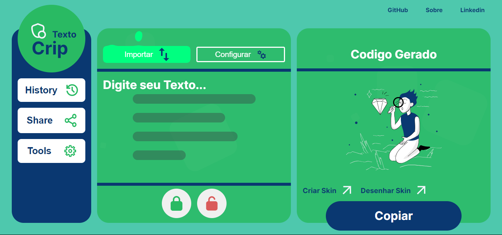

## Descrição
O **CripTexto** é uma aplicação web desenvolvida para criptografar e descriptografar textos, além de oferecer funcionalidades adicionais como importação de arquivos PDF e TXT, manipulação de templates e geração de documentos em PDF, você pode usar Temas já prontos ou pode criar seu propios tema usando AI, isso usando um estilo propio de cbt ou seja com base no tema fonercido a AI gerar um tema usando um findTunner Especifico.

## Vizualizar Projeto
[Entre aqui para Vizualizar 📦](https://dvizioon.github.io/CRIP-TEXTO/)


## Desafio da Alura


## Índice
1. [Descrição](#descrição)
2. [Funcionalidades](#funcionalidades)
3. [Tecnologias Utilizadas](#tecnologias-utilizadas)
4. [Fluxo de Segurança](#fluxo-de-segurança)
5. [Fluxo de Renderização AI](#fluxo-de-renderização-ai)
6. [Plugins Criados](#plugins-criados)
7. [Exemplos de Uso](#exemplos-de-uso)
8. [Instalação](#instalação)
9. [Licença](#licença)

## Figma do Projeto 
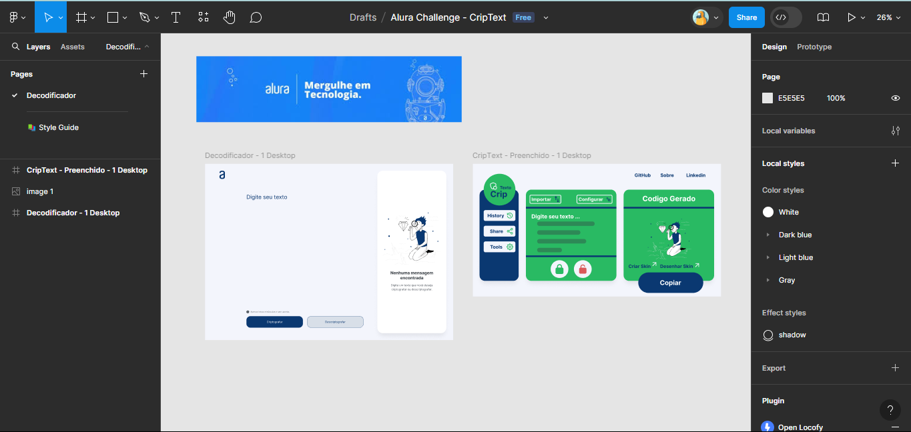

[Projeto Original🔰](https://www.figma.com/design/tvFEYhVfZTjdJ5P24RGV21/Alura-Challenge---Desafio-1---L%C3%B3gica?node-id=0-1&t=IUGPCMTEk0xgJMEC-1)

## Para Alura Vizualizar
**Senha** : _one_

> Entre em Exemplos 
- Alura + Senha.pdf
- Alura.html
- Alura.pdf

`Entre em Exemples/`

[Entre aqui para ver os Exemplos](/Examples/)

>[!WARNING]
>Depois você pode Entrar e Importa o PDF para criar a descriptografia melhor importar que copiar e colar por causas dos espaçamentos

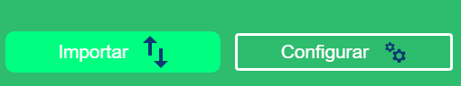

<br>

## Para iniciar
para iniciar primeiro vamos mapear seu sevidor Local para 
libera a AI em seu IP -> (IPV4) -> Publico
Assim você poderar usar um AI do Aplicativo
e para fazer isso precisar criar um Proxy trasparente e conectar o 
DNS nesse proxy para criar a chave de autenticação


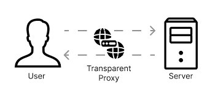
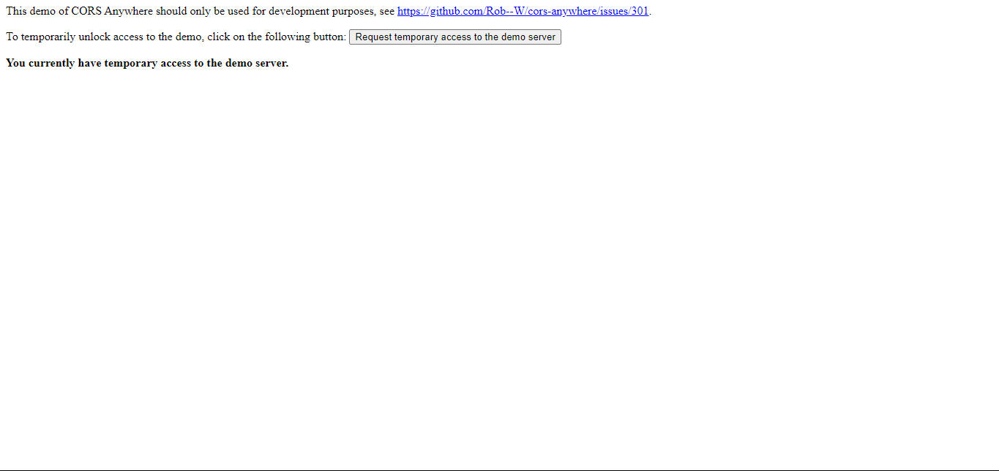

>[!IMPORTANT]
>Entre aqui para Liberar o Seu Local<br>
>https://cors-anywhere.herokuapp.com/corsdemo
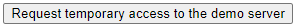

## Engenharia AI - AUTOAUTH

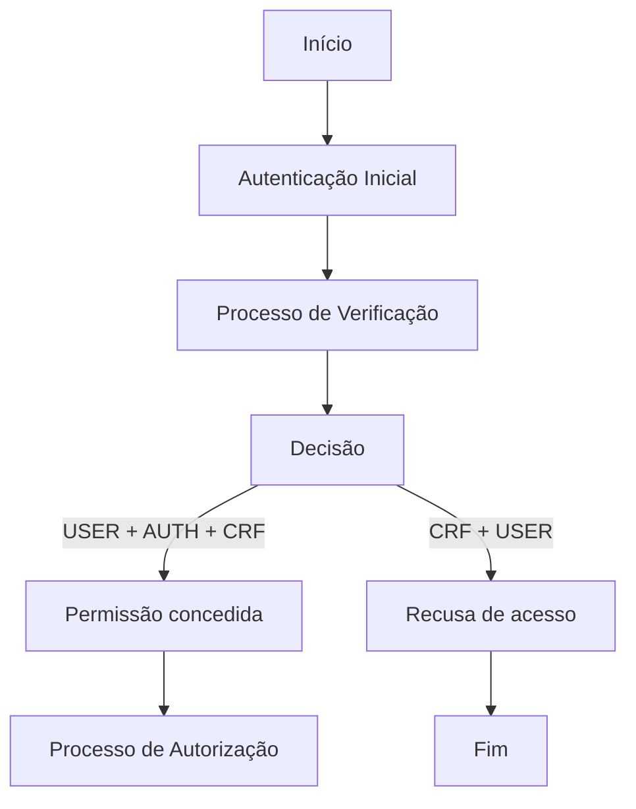


## Funcionalidades

- **Criptografar e Descriptografar:** Permite aos usuários inserir texto e realizar operações de criptografia e descriptografia utilizando métodos seguros.
- **Importação de Arquivos:** Suporta importação de arquivos nos formatos PDF e TXT para visualização e manipulação de conteúdo.
- **Templates de Documentos:** Oferece modelos pré-definidos para facilitar a criação de documentos padronizados.
- **Exportação em PDF:** Permite salvar documentos criados como arquivos PDF, com opção de proteção por senha para garantir a segurança dos documentos.
- **Desenho de Templates Personalizados:** Funcionalidade para desenhar templates personalizados diretamente na aplicação, permitindo a criação de layouts únicos.
- **Histórico de Templates:** Mantém um registro de templates criados, facilitando o acesso e a gestão de documentos anteriores.

## Tecnologias Utilizadas

- **Front-end:** HTML, CSS, JavaScript (ES6+)
- **Bibliotecas Externas:**
  - jsPDF: Para geração de documentos em PDF no navegador.
  - pdf.js: Para visualização e extração de texto de arquivos PDF.
  - SweetAlert2: Para exibição de alertas e prompts personalizados.
- **Armazenamento Local:** LocalDB.js para gerenciamento de banco de dados local no navegador, facilitando o armazenamento e recuperação de templates e configurações.

## FLuxo de Segurança
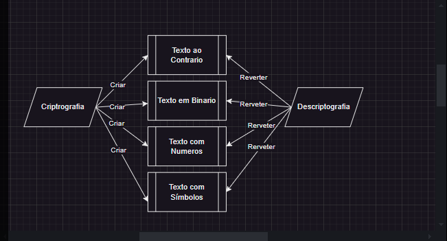

## Fluxo de Rederização AI
- Entre no `Assistent.js` e Mude Logica eo temperamento da AI para gerar os temas

>[!IMPORTANT]
>Para Criar um FIndTunner bom é necessario adptar esse plugin de assistencia é criar um filtro mais especifico assim criar um filtro mais especifico.

```javascript
btn_search.addEventListener('click', function () {
    
    const question = `
    Por favor, crie uma página de convite em HTML e CSS com as seguintes características
    Quero uma página unica, com o seguinte tema ${input_search.value}:

    obs1:quero as cores que codizem como o tema ${input_search.value} e os Textos também:

    obs2:Quero o codigo entre """ Codigo Aqui dentro """
    1 **Faça o Estilo usando de ${input_search.value} é use <style></style> faça o body padrão é 
        -Faça a Font se adptar de acordo com o tema para os <p> adptar as cores por exemplo se o tema for dark usar cores white
        -Para cada elemento ultizar o display:Flex;
        -Para cada elmento coloque o width:100%:
        -para cada elemento use o Gap;
        -para cada elemento use class unicas e estilos unicos
    **
    - No Estilo não quero estilo nem **Body**

    2**Dentro do Body Coloque esse Codigo aqui porem vc vai adptar ao tema que a pessoa pediu que é ${input_search.value} **:
    '
        <div class='cartao'>
            <!-- Aqui Colocar Titulo -->
            <h1>[]</h1>
            <!-- Aqui Sobre o tema : Pequeno Texto -->
            <p>[]</p>
            <!-- Aqui Colocar Msg para Descriptgrafar -->
            <p>[]</p>
            <textarea id='texto_codificado' class='texto_codificado' placeholder='Digite o texto codificado aqui' disabled></textarea>
            <input type='password' class='password' id='senha' placeholder='Digite a senha'>
            <button class='descriptografar'>Descriptografar 🔓</button>
            <textarea id='texto_decifrado' class='texto_decifrado' placeholder='Texto decifrado aparecerá aqui' readonly></textarea>
        </div>
    '

    Aguardo o código completo. Obrigado!
`

  ...

})
```

## Plugins Criados

- Import.js


>[!WARNING]
>Plugin para Criar as importação com uma Atributo especial chamado `data-type`

```javascript
class FileImporter {
    constructor(buttonSelector, displaySelector) {
        this.buttons = document.querySelectorAll(buttonSelector);
        this.displayElement = document.querySelector(displaySelector);
        this.init();
    }

    init() {
        this.fileInput = document.createElement('input');
        this.fileInput.type = 'file';
        this.fileInput.style.display = 'none';
        document.body.appendChild(this.fileInput);

        this.buttons.forEach(button => {
            button.addEventListener('click', (event) => this.handleButtonClick(event));
        });

        this.fileInput.addEventListener('change', (event) => this.handleFileChange(event));
    }

    handleButtonClick(event) {
        const fileType = event.target.getAttribute('data-type');

        if (fileType === 'txt') {
            this.fileInput.setAttribute('accept', '.txt');
            this.fileInput.click();
        } else if (fileType === 'pdf') {
            this.fileInput.setAttribute('accept', '.pdf');
            this.fileInput.click();
        }
    }

    ...

```

>[!NOTE]
>Para Vizualizar todos os Plugins diponiveis entre em `Plugins`.

Você pode querer criar mais de um Acionador aqui para modal 

```javascript
document.addEventListener('DOMContentLoaded', () => {
    const modals = [
        { modalId: 'modal-skins', buttonId: 'openModalSkins', elementoEmpyt: 'texto_codificado', actions: [] },
        { modalId: 'modal-paint', buttonId: 'openModalPaint', elementoEmpyt: 'texto_codificado', actions: [] },
        { modalId: 'modal-history', buttonId: 'openModalHistory', actions: [{ 'tbody': loadTemplates }] },
        { modalId: 'modal-import', buttonId: 'gooey-button'}
    ];

    modals.forEach(modal => {
        new Modal(modal.modalId, modal.buttonId, modal.elementoEmpyt, modal.actions);
    });
});
```
- modalId: `Identificador da Modal`
- buttonId: `Acionador da Modal`
- ElementoEmpyte : `Verificar se certo elemento está vazio antes de acionar a modal`
- Actions: [
    `{'_elemento':_Atualização}`
] -> `Responsável por força atualização do elemento.`


>[!NOTE]
>Para Vizualizar Templates `Js/Templates.js`.

Você pode querer criar mais de um Template

```javascript
const all_Templates = [
    {
        "cartão de Namoro": {
            html: `
               ...
            `,
            style: `
               ...
            `,
            script: `
               ...
            `
        }
    }
];
```

## Fonts 
>[!TIP]
>`https://fonts.googleapis.com/css2?family=Inter:wght@100..900&display=swap `

```css
@font-face {
    font-family: 'Inter';
    font-style: normal;
    font-weight: 100 900;
    font-display: swap;
    src: url(https://fonts.gstatic.com/s/inter/v13/UcC73FwrK3iLTeHuS_fvQtMwCp50KnMa2JL7SUc.woff2) format('woff2');
    unicode-range: U+0460-052F, U+1C80-1C88, U+20B4, U+2DE0-2DFF, U+A640-A69F, U+FE2E-FE2F;
}

```

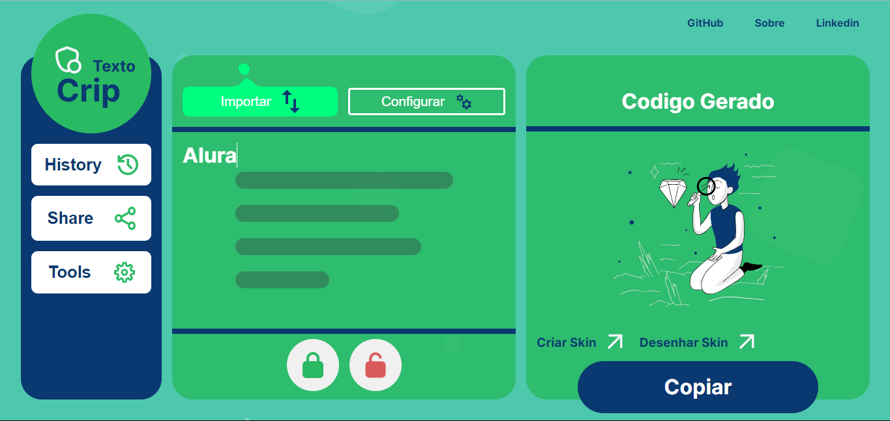

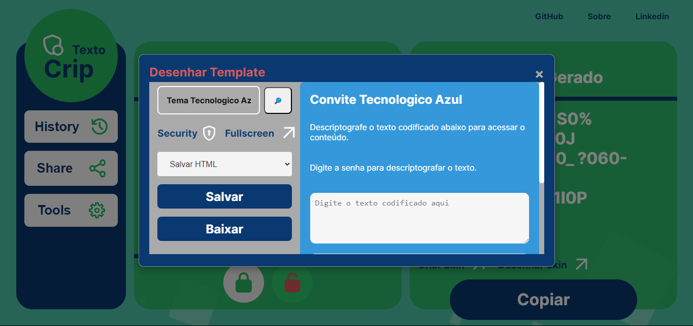
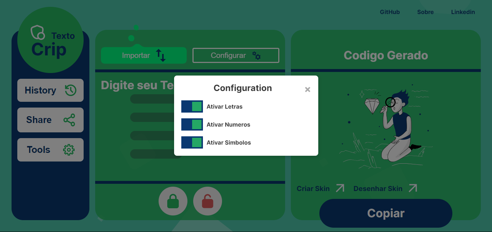

## Instalação

1. Clone o repositório: `git clone https://github.com/dvizioon/CRIP-TEXTO.git`
2. Abra o diretório do projeto: `cd CRIP-TEXTO`
3. Abra o arquivo `index.html` no seu navegador web.


## Licença

Este projeto está licenciado sob a [Licença MIT](LICENSE).
